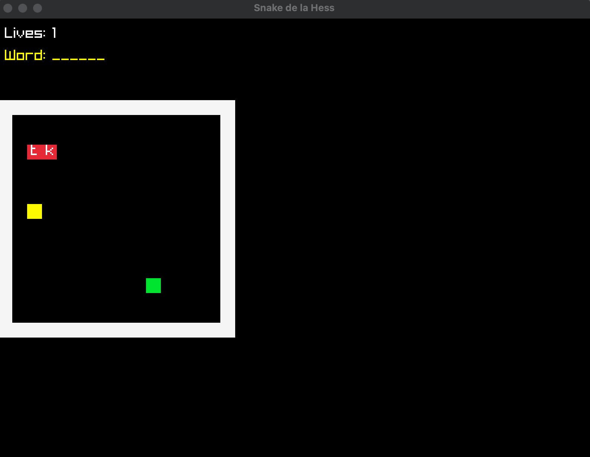

<h1>THE HANGED SNAKE GAME</h1>
- Developed by Camille Nguyen : CCU Project Design course

Basics of the game:
In this game, you will be able to play as a snake wandering the confines of a small room. 
You will find in this room some letters, which you will need to create a magical word.
If you manage to complete the word, congratulations, you win!

There are also boosters with different effects to help you in your journey.

However, be careful of crashing into the walls or into yourself (the snake can feel pain, too)...

<h2>How to run this game:</h2>

<h3>If the snake.exe file exists:</h3>
<pre>
From the root folder:
$ ./snake
</pre>

<h3>If the snake.exec file does not exist:</h3>
<pre>
From the root folder:
$ mkdir build
$ cd build
$ cmake ..
$ cmake --build . || $ make
</pre>
